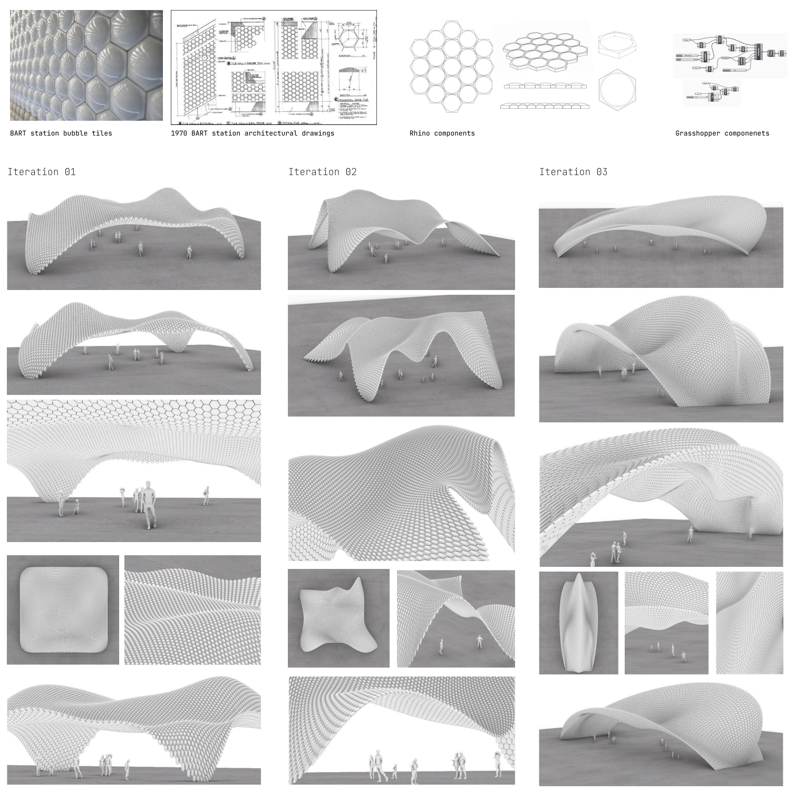

# parametric-hexsrfs

As a regular BART (Bay Area Rapid Transit) rider, the subtly unique white ceramic tiles at each station
pique my interest on each commute. These iconic “bubble” tiles have been around since the first BART
stations opened in 1973, and continue to be featured in new station extensions today.

After learning Rhino and Grasshopper in a 3D modelling course at City College of San Francisco, I set out
to model a conceptual BART station entrance installation. I aimed to combine the original bubble tile
blueprints with a lofty parametric design inspired by Santiago Calatrava’s Liege-Guillemins train station
and Fernando Romero’s Museo Soumaya. I first recreated the tile geometry in Rhino, and then used
Grasshopper to experiment with morphing hexagonal tessellations onto various parameterized surfaces.

 
